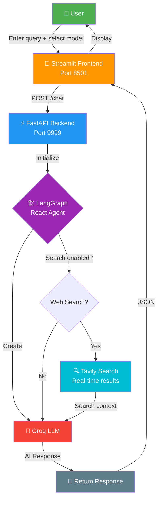

# 🤖 Multi-AI Agent using Groq & Tavily

A multi-AI agent application that combines **Groq LLM**, **Tavily Search**, and **LangGraph** for intelligent task execution. Built with **FastAPI** backend and **Streamlit** frontend, deployable on **GCP Cloud Run** via **Jenkins CI/CD**.

---

## 🌟 Features

- ✨ **Multi-Model Support** — Switch between Groq models (Qwen, Llama, Mixtral, Gemma)
- 🔍 **Web Search Integration** — Tavily Search for real-time information retrieval
- 🏗️ **Agent Architecture** — LangGraph-based system with `create_react_agent`
- ⚡ **FastAPI Backend** — REST API on port 9999
- 🎨 **Streamlit Frontend** — Interactive UI on port 8501
- 🐳 **Docker Ready** — Multi-stage optimized builds
- ☁️ **GCP Cloud Run** — Cloud deployment
- 🔌 **CI/CD** — Jenkins + SonarQube

---

## 🔄 Workflow

### Application Flow



### CI/CD Pipeline


---

## 🚀 Quick Start

### Prerequisites

- Python 3.12+
- [Groq API Key](https://console.groq.com) & [Tavily API Key](https://tavily.com)

### Setup & Run

```bash
git clone https://github.com/farhanrhine/multi-ai-agent-gcp.git
cd multi-ai-agent-gcp

cp .env.example .env   # Add your API keys

uv sync                # Install dependencies
python main.py         # Start app
```

- 🎨 **UI**: <http://localhost:8501>
- ⚙️ **API Docs**: <http://localhost:9999/docs>

---

## 🐳 Docker

```bash
# Build & run
docker build -t multi-ai-agent:latest .
docker run -it -p 8501:8501 -p 9999:9999 \
  -e GROQ_API_KEY=your_key -e TAVILY_API_KEY=your_key \
  multi-ai-agent:latest

# Or use Docker Compose (App + Jenkins + SonarQube)
docker-compose up -d
```

---

## 📚 API

**POST** `/chat`

```json
{
  "model_name": "llama-3.3-70b-versatile",
  "system_prompt": "You are a helpful assistant",
  "messages": ["What is the weather today?"],
  "allow_search": true
}
```

**Supported Models:** `qwen/qwen3-32b` · `qwen/qwen3-72b` · `llama-3.3-70b-versatile` · `mixtral-8x7b-32768` · `gemma2-9b-it`

---

## ☁️ GCP Cloud Run Deployment

```bash
gcloud auth login
gcloud config set project YOUR_PROJECT_ID

# Create repo & configure Docker
gcloud artifacts repositories create multi-ai-agent --repository-format=docker --location=us-central1
gcloud auth configure-docker us-central1-docker.pkg.dev

# Build, push & deploy
docker build -t multi-ai-agent:latest .
docker tag multi-ai-agent:latest us-central1-docker.pkg.dev/YOUR_PROJECT_ID/multi-ai-agent/multi-ai-agent:latest
docker push us-central1-docker.pkg.dev/YOUR_PROJECT_ID/multi-ai-agent/multi-ai-agent:latest

gcloud run deploy multi-ai-agent-service \
  --image us-central1-docker.pkg.dev/YOUR_PROJECT_ID/multi-ai-agent/multi-ai-agent:latest \
  --region us-central1 --allow-unauthenticated --port 8501 \
  --memory 2Gi --cpu 2 \
  --set-env-vars GROQ_API_KEY=xxx,TAVILY_API_KEY=xxx
```

Or use the included `Jenkinsfile` for automated CI/CD deployment.

---

## 📂 Project Structure

```
multi-ai-agent-gcp/
├── app/
│   ├── backend/api.py          # FastAPI REST API
│   ├── frontend/ui.py          # Streamlit UI
│   ├── core/ai_agent.py        # LangGraph react agent
│   ├── config/settings.py      # Environment & model config
│   └── common/                 # Logger & custom exceptions
├── custom_jenkins/Dockerfile   # Jenkins image with GCP SDK
├── Dockerfile                  # Multi-stage production build
├── docker-compose.yml          # Local dev stack
├── Jenkinsfile                 # CI/CD pipeline
├── main.py                     # Entry point
├── pyproject.toml              # Dependencies
└── .env.example                # Environment template
```

---

**Built with ❤️ using Groq, Tavily, LangGraph, FastAPI, and Streamlit**
