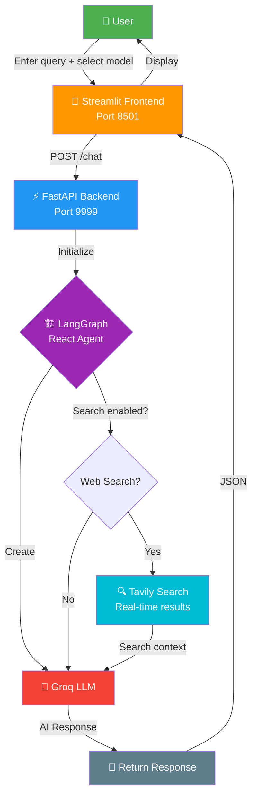

# 🤖 Multi-AI Agent using Groq & Tavily

A production-ready multi-AI agent application that combines **Groq LLM**, **Tavily Search**, and **LangGraph** for intelligent task execution. Built with **FastAPI** backend and **Streamlit** frontend, deployable on **GCP Cloud Run**.

---

## 🌟 Features

- ✨ **Multi-Model Support** — Switch between Groq models (Qwen, Llama, Mixtral, Gemma)
- 🔍 **Web Search Integration** — Tavily Search for real-time information retrieval
- 🏗️ **Agent Architecture** — LangGraph-based multi-agent system with `create_react_agent`
- ⚡ **FastAPI Backend** — High-performance REST API
- 🎨 **Streamlit Frontend** — Interactive user interface
- 🐳 **Docker Ready** — Multi-stage optimized Docker builds
- ☁️ **GCP Cloud Run** — One-command cloud deployment
- 🔌 **CI/CD Pipeline** — Jenkins automation with SonarQube integration

---

## 🔄 Workflow

### Application Flow



### CI/CD Pipeline


---

## 🚀 Quick Start

### Prerequisites

- Python 3.12+
- [uv](https://docs.astral.sh/uv/) package manager (or pip)
- Docker & Docker Compose (for containerized deployment)
- [Groq API Key](https://console.groq.com)
- [Tavily API Key](https://tavily.com)

### Installation

#### 1. Clone Repository

```bash
git clone https://github.com/farhanrhine/multi-ai-agent-gcp.git
cd multi-ai-agent-gcp
```

#### 2. Setup Environment

```bash
# Copy environment template
cp .env.example .env

# Edit .env with your API keys
nano .env  # or use your preferred editor
```

**Required environment variables:**

```env
GROQ_API_KEY=gsk_your_groq_api_key_here
TAVILY_API_KEY=tvly-dev_your_tavily_api_key_here
```

#### 3. Install Dependencies

**Using uv (recommended):**

```bash
uv sync
```

**Using pip:**

```bash
python -m venv venv
source venv/bin/activate  # On Windows: venv\Scripts\activate
pip install -e .
```

#### 4. Run Application

```bash
python main.py
```

Access the application:

- 🎨 **Streamlit UI**: <http://localhost:8501>
- ⚙️ **FastAPI Docs**: <http://localhost:9999/docs>
- 🔌 **API Endpoint**: <http://localhost:9999/chat>

---

## 🐳 Docker Deployment

### Build & Run

```bash
# Build image
docker build -t multi-ai-agent:latest .

# Run container
docker run -it \
  -p 8501:8501 \
  -p 9999:9999 \
  -e GROQ_API_KEY=your_key_here \
  -e TAVILY_API_KEY=your_key_here \
  multi-ai-agent:latest
```

### Docker Compose (Local Development)

```bash
# Start all services (App + Jenkins + SonarQube)
docker-compose up -d

# View logs
docker-compose logs -f app

# Stop services
docker-compose down
```

This starts:

- 🎨 **App** (Streamlit + FastAPI): <http://localhost:8501>
- 🔧 **Jenkins** (CI/CD): <http://localhost:8080>
- 📊 **SonarQube** (Code Quality): <http://localhost:9000>

---

## 📚 API Usage

### Chat Endpoint

**POST** `/chat`

Request:

```json
{
  "model_name": "llama-3.3-70b-versatile",
  "system_prompt": "You are a helpful assistant",
  "messages": ["What is the weather today?"],
  "allow_search": true
}
```

Response:

```json
{
  "response": "..."
}
```

### Supported Models

| Model | Description |
|-------|-------------|
| `qwen/qwen3-32b` | Qwen 32B |
| `qwen/qwen3-72b` | Qwen 72B |
| `llama-3.3-70b-versatile` | Llama 3.3 70B |
| `mixtral-8x7b-32768` | Mixtral 8x7B |
| `gemma2-9b-it` | Gemma 2 9B |

---

## ☁️ GCP Cloud Run Deployment

### Prerequisites

1. [Google Cloud SDK](https://cloud.google.com/sdk/docs/install) installed
2. GCP project with billing enabled
3. Artifact Registry API enabled
4. Cloud Run API enabled

### Deploy via CLI

```bash
# Authenticate
gcloud auth login
gcloud config set project YOUR_PROJECT_ID

# Create Artifact Registry repository
gcloud artifacts repositories create multi-ai-agent \
  --repository-format=docker \
  --location=us-central1

# Configure Docker
gcloud auth configure-docker us-central1-docker.pkg.dev

# Build & push
docker build -t multi-ai-agent:latest .
docker tag multi-ai-agent:latest us-central1-docker.pkg.dev/YOUR_PROJECT_ID/multi-ai-agent/multi-ai-agent:latest
docker push us-central1-docker.pkg.dev/YOUR_PROJECT_ID/multi-ai-agent/multi-ai-agent:latest

# Deploy to Cloud Run
gcloud run deploy multi-ai-agent-service \
  --image us-central1-docker.pkg.dev/YOUR_PROJECT_ID/multi-ai-agent/multi-ai-agent:latest \
  --region us-central1 \
  --allow-unauthenticated \
  --port 8501 \
  --memory 2Gi \
  --cpu 2 \
  --set-env-vars GROQ_API_KEY=xxx,TAVILY_API_KEY=xxx
```

### Deploy via Jenkins CI/CD

The included `Jenkinsfile` automates:

1. **GitHub Integration** — Automatic builds on push
2. **Code Quality** — SonarQube analysis
3. **Docker Build** — Multi-stage optimized builds
4. **Registry Push** — GCP Artifact Registry
5. **Cloud Deploy** — Automatic deployment to Cloud Run

---

## Project Structure

```
multi-ai-agent-gcp/
├── app/
│   ├── backend/              # FastAPI server
│   │   ├── api.py            # REST API endpoints
│   │   └── __init__.py
│   ├── frontend/             # Streamlit UI
│   │   ├── ui.py             # User interface
│   │   └── __init__.py
│   ├── common/               # Shared utilities
│   │   ├── logger.py         # Logging configuration
│   │   ├── custom_exception.py
│   │   └── __init__.py
│   ├── config/               # Configuration
│   │   ├── settings.py       # Environment variables & model list
│   │   └── __init__.py
│   ├── core/                 # AI agent logic
│   │   ├── ai_agent.py       # LangGraph react agent
│   │   └── __init__.py
│   └── __init__.py
├── custom_jenkins/           # Jenkins Docker image
│   └── Dockerfile
├── Dockerfile                # Multi-stage production build
├── docker-compose.yml        # Local dev (App + Jenkins + SonarQube)
├── Jenkinsfile               # CI/CD pipeline (GCP)
├── pyproject.toml            # Dependencies
├── uv.lock                   # Locked dependencies
├── main.py                   # Entry point (starts backend + frontend)
├── .env.example              # Environment template
├── .dockerignore
├── .gitignore
└── README.md
```

---

## 🔐 Security Best Practices

- ✅ **Never commit `.env`** — Use `.env.example` as template
- ✅ **Use environment variables** — For all sensitive configuration
- ✅ **Rotate API keys regularly** — Groq and Tavily tokens
- ✅ **Enable HTTPS** — For production deployments
- ✅ **Monitor logs** — For suspicious activity

---

## 🧪 Testing

```bash
# Run locally
uv run python main.py

# Test with Docker
docker run -e GROQ_API_KEY=xxx -e TAVILY_API_KEY=xxx multi-ai-agent:latest

# Test API endpoint
curl -X POST http://localhost:9999/chat \
  -H "Content-Type: application/json" \
  -d '{"model_name":"llama-3.3-70b-versatile","system_prompt":"You are helpful","messages":["Hello"],"allow_search":false}'
```

---

## 🐛 Troubleshooting

### API Keys Not Found

```
ValueError: GROQ_API_KEY not set in environment variables
```

→ Ensure `.env` exists with valid keys, or set them as shell environment variables.

### Port Already in Use

```
Address already in use: ('0.0.0.0', 8501)
```

→ Kill the process using the port: `lsof -i :8501` then `kill -9 <PID>`

### Docker Build Fails

```
ERROR: cannot find module
```

→ Rebuild without cache: `docker build --no-cache -t multi-ai-agent:latest .`

### Connection Refused

```
Connection refused: http://localhost:9999
```

→ Ensure backend is running. In Docker, use service name: `http://app:9999/chat`

---

## 📊 Performance

- **Multi-stage Docker build** — Reduced image size by ~70%
- **uv package manager** — 45x faster dependency resolution
- **Async operations** — FastAPI asynchronous request handling
- **LangGraph React Agent** — Optimized agent execution pipeline

---

## 🔄 Development Workflow

1. **Develop** → `python main.py` (local)
2. **Test** → `docker-compose up` (containerized)
3. **Build** → `docker build -t multi-ai-agent:latest .`
4. **Push** → `docker push <registry>/multi-ai-agent:latest`
5. **Deploy** → Jenkins pipeline auto-deploys to GCP Cloud Run

---

## 📝 Contributing

1. Fork the repository
2. Create feature branch: `git checkout -b feature/AmazingFeature`
3. Commit changes: `git commit -m 'Add AmazingFeature'`
4. Push to branch: `git push origin feature/AmazingFeature`
5. Open Pull Request

---

## 📄 License

This project is open source and available under the MIT License.

---

## 🎯 Roadmap

- [ ] WebSocket support for real-time streaming
- [ ] Multi-turn conversation memory
- [ ] Redis caching layer
- [ ] Authentication & authorization
- [ ] Performance monitoring dashboard
- [ ] Custom agent creation interface

---

**Built with ❤️ using Groq, Tavily, LangGraph, FastAPI, and Streamlit**

**Repository**: [github.com/farhanrhine/multi-ai-agent-gcp](https://github.com/farhanrhine/multi-ai-agent-gcp)
